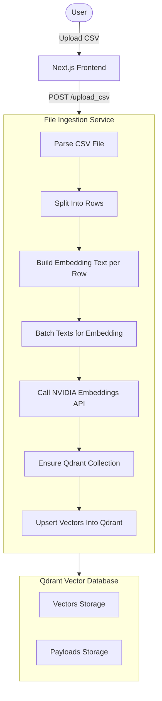
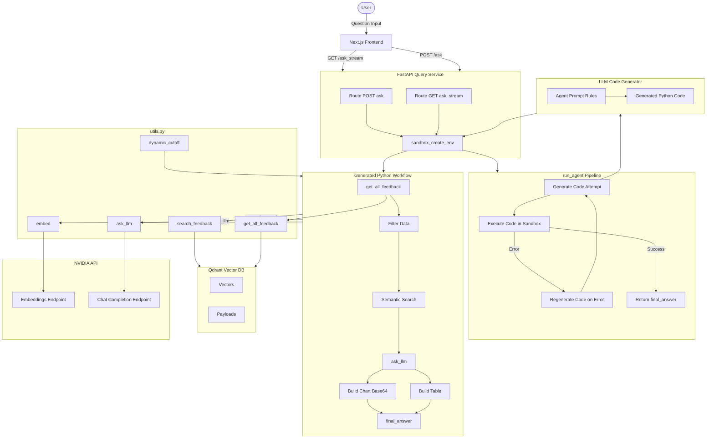

```mermaid
flowchart TD

User([User])
Frontend[Next.js Frontend]

User -->|Upload CSV| Frontend
Frontend -->|POST /upload_csv| IngestionService

subgraph IngestionService[File Ingestion Service]
    direction TB

    ING_File[Parse CSV File]
    ING_Split[Split Into Rows]
    ING_Build[Build Embedding Text per Row]
    ING_Batch[Batch Texts for Embedding]
    ING_Embed[Call NVIDIA Embeddings API]
    ING_Create[Ensure Qdrant Collection]
    ING_Upsert[Upsert Vectors Into Qdrant]
end

IngestionService --> QdrantDB

subgraph QdrantDB[Qdrant Vector Database]
    Q_Vectors[Vectors Storage]
    Q_Payloads[Payloads Storage]
end

ING_File --> ING_Split --> ING_Build --> ING_Batch --> ING_Embed --> ING_Create --> ING_Upsert
```

```mermaid
flowchart TD

User([User])
Frontend[Next.js Frontend]

User -->|Question Input| Frontend

Frontend -->|GET /ask_stream| QueryService
Frontend -->|POST /ask| QueryService

subgraph QueryService[FastAPI Query Service]
    direction TB

    QS_Ask[Route POST ask]
    QS_Stream[Route GET ask_stream]
    QS_Sandbox[sandbox_create_env]

    QS_Ask --> QS_Sandbox
    QS_Stream --> QS_Sandbox
end

QS_Sandbox --> RunAgent

subgraph RunAgent[run_agent Pipeline]
    direction TB

    RA_Attempt[Generate Code Attempt]
    RA_Exec[Execute Code in Sandbox]
    RA_Fallback[Regenerate Code on Error]
    RA_Return[Return final_answer]

    RA_Attempt --> RA_Exec
    RA_Exec -->|Error| RA_Fallback --> RA_Attempt
    RA_Exec -->|Success| RA_Return
end

%% LLM Code Generator
RA_Attempt --> AgentLLM

subgraph AgentLLM[LLM Code Generator]
    A_Prompt[Agent Prompt Rules]
    A_Code[Generated Python Code]
    A_Prompt --> A_Code
end

AgentLLM --> QS_Sandbox

%% Generated Python Flow
QS_Sandbox --> GeneratedCode

subgraph GeneratedCode[Generated Python Workflow]
    direction TB

    GC_GetAll[get_all_feedback]
    GC_Filter[Filter Data]
    GC_Semantic[Semantic Search]
    GC_LLM[ask_llm]
    GC_Chart[Build Chart Base64]
    GC_Table[Build Table]
    GC_Final[final_answer]
end

GC_GetAll --> GC_Filter --> GC_Semantic --> GC_LLM
GC_LLM --> GC_Chart --> GC_Final
GC_LLM --> GC_Table --> GC_Final

%% Utils
subgraph Utils[utils.py]
    U_Embed[embed]
    U_Ask[ask_llm]
    U_Search[search_feedback]
    U_Dynamic[dynamic_cutoff]
    U_GetAll[get_all_feedback]
end

GeneratedCode -->|embed| U_Embed --> NvidiaEmbed
GeneratedCode -->|ask_llm| U_Ask --> NvidiaChat
GeneratedCode -->|semantic search| U_Search --> QdrantDB
U_Dynamic --> GeneratedCode
GC_GetAll --> U_GetAll --> QdrantDB

%% Qdrant
subgraph QdrantDB[Qdrant Vector DB]
    Q_Vectors[Vectors]
    Q_Payloads[Payloads]
end

%% NVIDIA
subgraph NvidiaAPI[NVIDIA API]
    NvidiaEmbed[Embeddings Endpoint]
    NvidiaChat[Chat Completion Endpoint]
end

```
